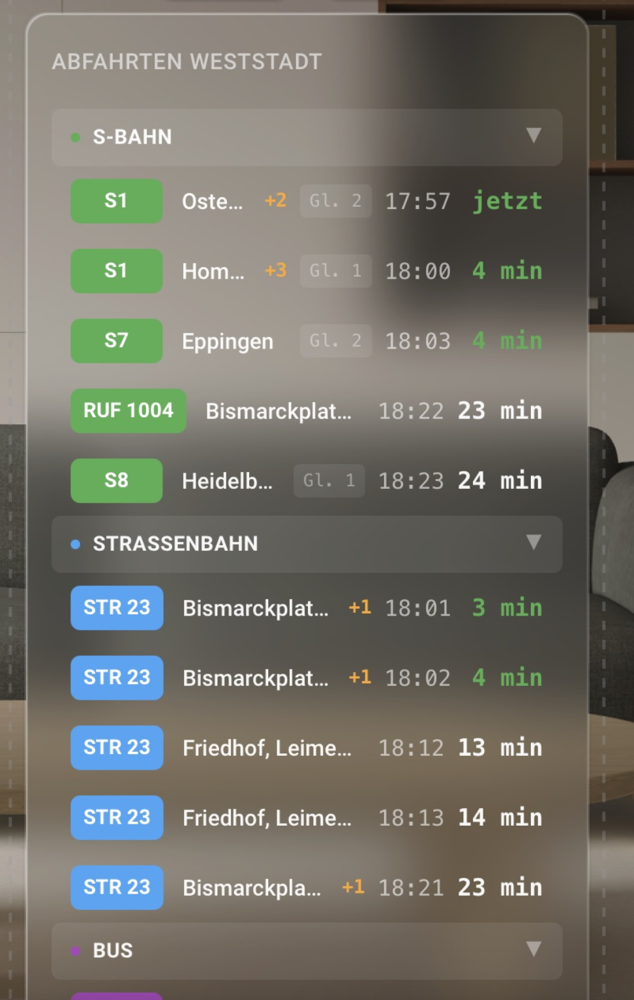

# Transit Card

A modern glass-style Lovelace card for Home Assistant displaying real-time S-Bahn, Tram, and Bus departures from the Deutsche Bahn API.



## Features

- Real-time departures from Deutsche Bahn API
- Glass/blur aesthetic with dark theme
- Collapsible sections for S-Bahn / Tram / Bus
- Live countdown updates (refreshes every second)
- Delay indicators (+3, +5 in orange/red)
- Platform display (Gl. 2)
- Configurable stops and refresh interval
- Works with any German transit stop

## Installation

### HACS (Recommended)

1. Open HACS in Home Assistant
2. Click the three dots menu → **Custom repositories**
3. Add this repository URL with category **Lovelace**
4. Search for "Transit Card" and install
5. Restart Home Assistant

### Manual

1. Download `transit-card.js` from the [latest release](../../releases)
2. Copy to `config/www/transit-card.js`
3. Add resource in **Settings → Dashboards → Resources**:
   - URL: `/local/transit-card.js`
   - Type: JavaScript Module

## Configuration

```yaml
type: custom:transit-card
title: Abfahrten
stops:
  sbahn: "8002681"
  tram:
    - "506913"
    - "506953"
  bus:
    - "518175"
    - "506901"
refresh_interval: 30
max_departures: 5
collapsed:
  - bus
style: glass
```

**Only configure the transit types you need.** Omit a section to hide it:

```yaml
# S-Bahn only
type: custom:transit-card
stops:
  sbahn: "8011160"
```

### Options

| Option | Type | Default | Description |
|--------|------|---------|-------------|
| `title` | string | - | Optional card header |
| `stops.sbahn` | string/array | - | S-Bahn stop ID(s). Omit to hide section. |
| `stops.tram` | string/array | - | Tram stop ID(s). Omit to hide section. |
| `stops.bus` | string/array | - | Bus stop ID(s). Omit to hide section. |
| `refresh_interval` | number | 30 | Refresh interval in seconds |
| `max_departures` | number | 5 | Max departures per section |
| `collapsed` | array | [] | Sections to start collapsed (`sbahn`, `tram`, `bus`) |
| `style` | string | `glass` | `glass` (blur effect) or `solid` |
| `proxy_url` | string | - | Custom CORS proxy URL (optional) |

## Finding Your Stop IDs

You must configure your own stop IDs. Here's how to find them:

### Method 1: DB API (Recommended)

Search for your stop:
```
https://v6.db.transport.rest/locations?query=Berlin+Hauptbahnhof
```

The `id` field in the response is your stop ID.

### Method 2: bahn.expert

1. Go to [bahn.expert](https://bahn.expert/)
2. Search for your station
3. The stop ID is in the URL

### Method 3: Common Stop IDs

<details>
<summary><b>Heidelberg</b></summary>

| Stop | ID | Type |
|------|-----|------|
| Heidelberg Hbf | 8000156 | S-Bahn |
| Weststadt/Südstadt | 8002681 | S-Bahn |
| Bismarckplatz | 506903 | Tram |
| Christuskirche | 506913 | Tram |
| Römerkreis Süd | 506953 | Tram |
| Kaiserstraße | 518175 | Bus |
| Alois-Link-Platz | 506901 | Bus |

</details>

<details>
<summary><b>Berlin</b></summary>

| Stop | ID | Type |
|------|-----|------|
| Berlin Hbf | 8011160 | S-Bahn/Regional |
| Alexanderplatz | 900100003 | S-Bahn/U-Bahn |
| Potsdamer Platz | 900100020 | S-Bahn |
| Friedrichstraße | 900100001 | S-Bahn |

</details>

<details>
<summary><b>München</b></summary>

| Stop | ID | Type |
|------|-----|------|
| München Hbf | 8000261 | S-Bahn/Regional |
| Marienplatz | 625031 | S-Bahn/U-Bahn |
| Karlsplatz (Stachus) | 625026 | S-Bahn |

</details>

## Troubleshooting

### "Keine Abfahrten gefunden" (No departures)

1. **Check the browser console** (F12) for errors
2. **CORS issues**: The card uses fallback proxies automatically. If still failing, try:
   ```yaml
   proxy_url: "https://corsproxy.io/?"
   ```
3. **API rate limiting**: The DB API sometimes returns 503 errors. Wait a few minutes.

### Card not showing

1. Clear browser cache (Ctrl+Shift+R)
2. Check that the resource is loaded in **Settings → Dashboards → Resources**
3. Restart Home Assistant

## License

MIT

## Credits

- Transit data: [v6.db.transport.rest](https://v6.db.transport.rest/) (CC BY 4.0)
- Inspired by real German transit departure boards
