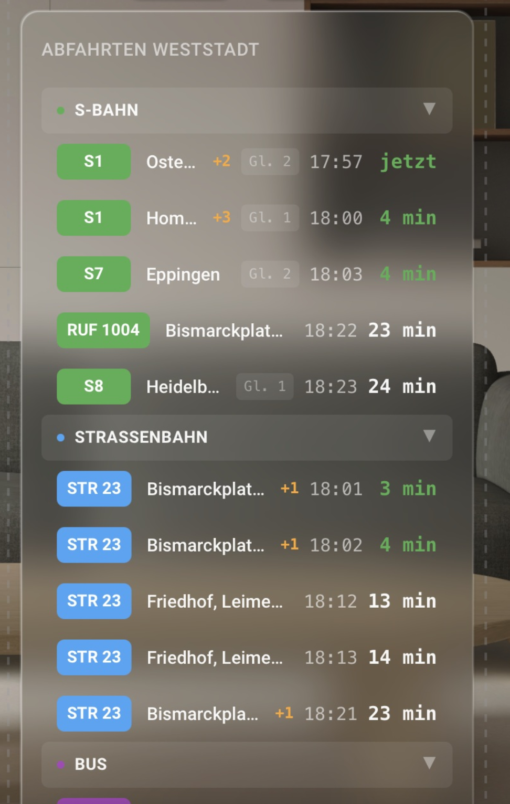

# Transit Card

A modern glass-style Lovelace card for Home Assistant displaying real-time S-Bahn, Tram, and Bus departures. The card **reads departures from Home Assistant entity attributes** — it makes no transit-API calls of its own. A single, rate-controlled poll lives on the HA side (a REST sensor), so the card simply renders whatever your entities expose.



> **v2 — breaking change.** Earlier versions fetched the Deutsche Bahn API directly from the browser. Deutsche Bahn retired the HAFAS backend and the public `v6.db.transport.rest` now shares a tiny rate limit (and frequently returns 503), which a browser client cannot honor. The card now sources data from HA entities instead. See [Migrating from v1](#migrating-from-v1).

## Features

- Departures sourced from Home Assistant entities (zero browser-side API calls, no CORS proxies)
- Reactive: re-renders the moment HA pushes new entity state — no polling timer in the card
- Glass/blur aesthetic with dark theme
- Collapsible sections for S-Bahn / Tram / Bus
- Live countdown updates (local 1-second clock)
- Render-time freshness filtering (hides cancelled / past / implausibly-delayed entries between server polls)
- Delay indicators (+3, +5), platform display (Gl. 2), stale-data indicator
- List or 2-column map layout

## Installation

### HACS (Recommended)

1. Open HACS → three-dots menu → **Custom repositories**
2. Add this repository URL with category **Lovelace**
3. Search for "Transit Card", install, and restart Home Assistant

### Manual

1. Download `transit-card.js` from the [latest release](../../releases)
2. Copy to `config/www/transit-card.js`
3. Add a resource in **Settings → Dashboards → Resources**: URL `/local/transit-card.js`, type **JavaScript Module**

## Configuration

Each transit type points at **one Home Assistant entity** whose `departures` attribute holds the list (see [the data contract](#departure-data-contract)).

### List layout (default)

```yaml
type: custom:transit-card
title: Abfahrten
stops:
  sbahn: sensor.transit_s_bahn_all      # string shorthand
  tram: { entity: sensor.transit_tram_all }  # or object form
  bus: sensor.transit_bus_all
max_departures: 5
collapsed:
  - bus
style: glass
```

### Map layout (2-column)

```yaml
type: custom:transit-card
title: Weststadt Transit
layout: map
stops:
  sbahn: sensor.transit_s_bahn_all
  tram: sensor.transit_tram_all
map:
  center: { lat: 49.3983, lng: 8.6887 }
  # Optional per-station coords (keyed by the payload's stopName) when the
  # payload itself carries no lat/lng:
  stops:
    Christuskirche: { lat: 49.40168, lng: 8.685209 }
max_departures: 3
```

Map markers and direction arrows come from configuration and/or optional payload fields (`lat`/`lng`/`directionArrow`) — the card performs no `/locations` lookups.

**Only configure the types you need** — omit a type to hide its section.

### Options

| Option | Type | Default | Description |
|--------|------|---------|-------------|
| `title` | string | – | Optional card header |
| `layout` | string | `list` | `list` or `map` |
| `stops.sbahn` | entity / `{entity}` | – | Source entity for S-Bahn. Omit to hide. |
| `stops.tram` | entity / `{entity}` | – | Source entity for Tram. Omit to hide. |
| `stops.bus` | entity / `{entity}` | – | Source entity for Bus. Omit to hide. |
| `max_departures` | number | 5 | Max departures per section |
| `collapsed` | array | `[]` | Sections to start collapsed (`sbahn`, `tram`, `bus`) |
| `style` | string | `glass` | `glass` (blur) or `solid` |
| `stale_threshold` | number | 180 | Seconds before the newest `last_updated` is flagged stale |
| `map.zoom` | number | auto | Map zoom (layout `map`) |
| `map.center` | object | auto | Map center `{ lat, lng }` (layout `map`) |
| `map.stops` | object | – | Per-station `{ lat, lng }`, keyed by `stopName` (layout `map`) |

## Departure data contract

The card reads `attributes.departures` from each source entity. Each element:

| Field | Type | Notes |
|-------|------|-------|
| `line` | string | e.g. `"S3"` (falls back to `"?"`) |
| `direction` | string | destination headsign |
| `planned` | string (ISO 8601) | scheduled departure |
| `when` | string \| null | realtime departure; `null` = no realtime data |
| `delay` | number | **minutes** (normalize server-side; `0`/absent = on time) |
| `platform` | string \| null | e.g. `"2"` → rendered as `Gl. 2` |
| `cancelled` | boolean | default `false` |
| `id` | string | optional, stable key |
| `directionArrow` | `'left'`\|`'right'`\|`null` | optional, for the map/list arrow |
| `stopName` | string | optional, used to group map markers |
| `lat` / `lng` | number | optional, map marker coordinates |

The countdown is computed from `when ?? planned`. Unknown fields are ignored; missing optional fields degrade gracefully.

## Supplying the data: Home Assistant + self-hosted db-vendo-client

Because the public DB endpoint is rate-limited/unreliable, run your own
[`db-vendo-client`](https://github.com/public-transport/db-vendo-client) and have HA poll it once per minute.

**1. Run db-vendo-client** (Docker; on a Proxmox LXC use `--network host` to avoid the unprivileged-port sysctl error):

```bash
docker run -d --name dbvendo --restart unless-stopped --network host \
  -e USER_AGENT="my-home-assistant (contact)" \
  -e DB_PROFILE=dbnav \
  ghcr.io/public-transport/db-vendo-client
# -> http://<host>:3000/stops/<id>/departures
```

**2. REST sensor — one poll/min into a `_raw` entity:**

```yaml
# configuration.yaml
rest:
  - resource: "http://<DBVENDO_HOST>:3000/stops/8002681/departures"
    scan_interval: 60
    params: { duration: 60, results: 8 }
    sensor:
      - name: "Transit S-Bahn Raw"
        unique_id: transit_s_bahn_raw
        value_template: "{{ (value_json.departures | default([])) | count }}"
        json_attributes: [departures]
```

**3. Template sensor — normalize raw FPTF into the card contract.** Filter on `line.product` (the `?suburban=&tram=&bus=` query params are unreliable on the `dbnav` profile) and convert `delay` from **seconds → minutes**:

```yaml
template:
  - sensor:
      - name: "Transit S-Bahn All"
        unique_id: transit_s_bahn_all
        state: >
          {{ (state_attr('sensor.transit_s_bahn_raw','departures') | default([]))
             | selectattr('line.product','eq','suburban') | list | count }}
        attributes:
          departures: >
            
            
            
              
            
            {{ ns.items }}
```

Then point the card at `sensor.transit_s_bahn_all`. Repeat per type, changing the stop ID and the `line.product` filter (`suburban` / `tram` / `bus`).

**Aggregating multiple stops into one type** (e.g. several tram stops): give each stop its own `_raw` REST sensor and merge them in the template (concatenate the per-stop lists before the loop), or query each and combine. Keep the merged list capped (`results: 8`) and consider excluding the `_raw`/`_all` sensors from the recorder to avoid DB growth:

```yaml
recorder:
  exclude:
    entity_globs:
      - sensor.transit_*_raw
```

## Migrating from v1

- `stops.{sbahn,tram,bus}` change from **DB stop-ID strings/arrays** to **HA entity references**. The card throws a clear `setConfig` error if it detects an old numeric stop ID.
- `proxy_url` and `refresh_interval` are **removed** (the card no longer fetches anything; HA controls the poll cadence).
- Set up the HA sensors above, then update your card YAML to reference the entities.

## Troubleshooting

| Symptom | Check |
|---|---|
| "Keine Abfahrten gefunden" | The source entity exists and its `departures` attribute is a non-empty list (Developer Tools → States). |
| Status shows **Fehler** | The configured entity is `unavailable`/`unknown`/missing, or the REST sensor isn't producing data. Check the db-vendo-client container and the REST sensor. |
| Status shows **Veraltet** (stale) | The newest `last_updated` is older than `stale_threshold` — the server-side poll has stopped (container down / DB outage). |
| Wrong modes in a section | Filter by `line.product` in the template (a multi-modal stop returns S-Bahn + tram + bus together). |
| `setConfig` error about a stop ID | You still have v1 numeric stop IDs in `stops.*`; switch to entity references. |

## License

MIT

## Credits

- Transit data via [db-vendo-client](https://github.com/public-transport/db-vendo-client) (DB APIs)
- Inspired by real German transit departure boards
